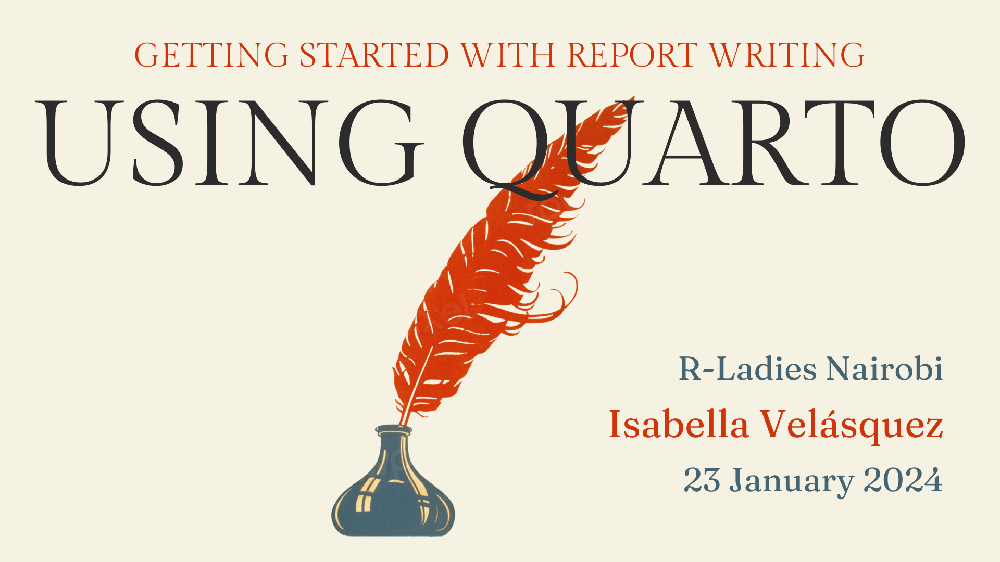

# Getting started with report writing using Quarto

## 2024-01-23 R-Ladies Nairobi webinar

### Instructions

Welcome to "Getting started with report writing using Quarto"! You have two options if you would like to follow along with the webinar:

- Follow along on <https://posit.cloud> OR
- Follow along on your Desktop

## Follow along on posit.cloud

<!-- badges: start -->

<!-- badges: end -->

- Please go to [posit.cloud](https://posit.cloud) and create an account (it is free)
- Ensure that you can access [the project](https://posit.cloud/content/7416825)

## Follow along on your Desktop

- Quarto is available in a [number of editors](https://quarto.org/docs/get-started/), including VS Code, Jupyter Lab, and more. For this workshop, we'll be working in RStudio.

- Download and install a recent release of [RStudio](https://posit.co/download/rstudio-desktop/) (v2023.06 or later)
- Clone the exercise repository: <https://github.com/ivelasq/reports-with-quarto-exercises>

## Webinar Slides

- [Quarto Pub](https://ivelasq.quarto.pub/getting-started-with-report-writing-using-quarto/)

## Resources

### Data

- [TidyTuesday](https://github.com/rfordatascience/tidytuesday)
- [@thedivtagguy's geocoding analysis](https://github.com/thedivtagguy/tidytuesday/tree/master/2024/week-03-polling-places/analysis)

### Native pipe

- [Understanding the native R pipe |>](https://ivelasq.rbind.io/blog/understanding-the-r-pipe/)

### Quarto

- [Quarto.org](https://www.quarto.org)
- [Awesome Quarto GitHub Repo](https://github.com/mcanouil/awesome-quarto)

### For R Markdown Users

* [FAQ for R Markdown Users](https://quarto.org/docs/faq/rmarkdown.html)
* [From R Markdown to Quarto workshop](https://rstudio-conf-2022.github.io/rmd-to-quarto/) taught by Dr. Mine Çetinkaya-Rundel and Dr. Andrew Bray

### Quartos and reports

- [Making Pretty PDFs with Quarto](https://nrennie.rbind.io/blog/making-pretty-pdf-quarto/) by Nicola Rennie
- [Tips for Custom Parameterized PDFs in Quarto](https://meghan.rbind.io/blog/quarto-pdfs/) by Meghan Hall
- [Introduction to Reproducible Publications with Quarto](https://www.youtube.com/watch?v=hgpL-sppw7E&t=4392s) by Torin White at R-Ladies Rome

### Title slide image

- [RawPixel](https://www.rawpixel.com/)

### knit_child()

- [Generating dynamic contents in R Markdown and Quarto](https://www.qiushiyan.dev/posts/dynamic-rmd-quarto/) by Qiushi Yan
- [knit_child in a loop - variable as title (StackOverflow)](https://stackoverflow.com/questions/43873345/knit-child-in-a-loop-variable-as-title)
- [How do I knit child doc uments with parameters into a main RMarkdown document? (StackOverflow)](https://stackoverflow.com/questions/70655915/how-do-i-knit-child-documents-with-parameters-into-a-main-rmarkdown-document)

### Parameterization

- [Parameterized Reporting with Quarto](https://jadeyryan.quarto.pub/rladies-abuja-quarto-params/) by Jadey Ryan at R-Ladies Abuja
